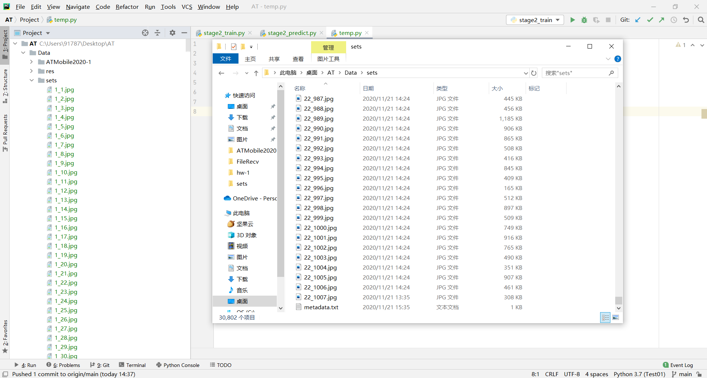
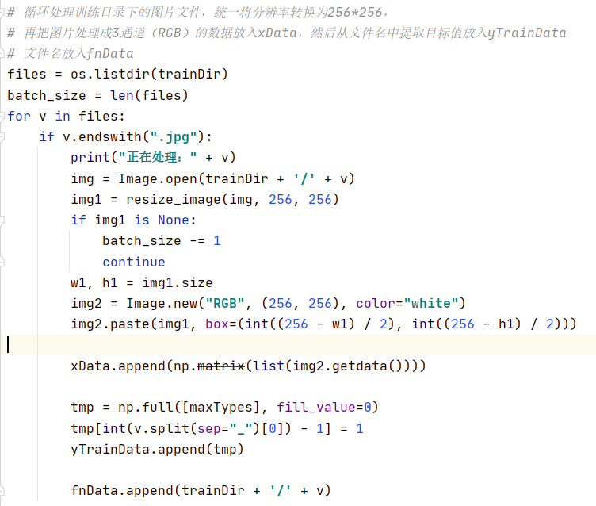
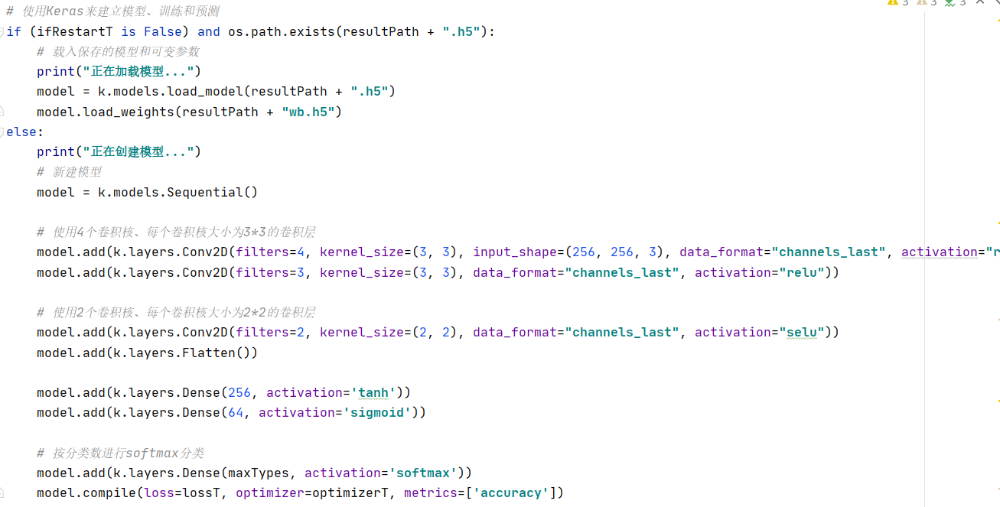
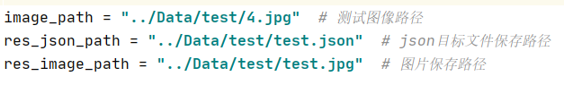
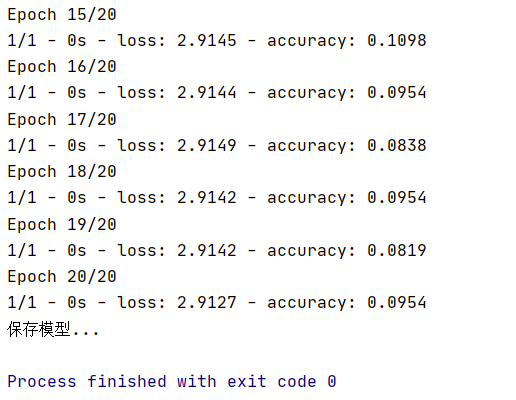

# AutomatedTesting2020

姓名：曹英瑞

学号：181250006

选题方向：移动应用

***

## 模型分析

### 模型结构
- 使用Tensorflow和Keras训练模型
- 使用cv2和PIL处理图片

### 运行步骤
1. 首先准备数据集（图片集）
	- 在阶段1中对所有控件的类别进行了统计，根据统计结果（见同目录下的ClassifyResult.txt文件）进行数据筛选。本实验选取了出现200次以上的控件种类，并通过OpenCV截图分类保存，最终保留了约1000份图片。之后将图片信息整合到Data/sets/metadata.csv文件中，供后续读取分析；图片一并放在Data/sets下。
	- 项目并未上传图片（空间太大），所以只放了metadata.csv文件，实际情况如图：
	
2. 其次对数据进行预处理
	- 统一将图片按256\*256三通道格式加载到训练集中。
	
3. 然后训练模型并保存
	- 相关参数参见代码。
	
4. 接着可以使用模型预测图片分类结果
	- 将预测函数外露，供后续调用。
5. 最后将其应用到图片标注当中
	- 修改stage2_predict中的文件路径并运行即可。
	- 
	- 在图片标注过程中利用cv2框选边界，再使用适当的算法整合微小且靠近的区域，然后对此区域截图进行预测，并将结果标注在图像上，同时生成目标文件。

### 相关参考文献
- https://www.cnblogs.com/caesar-the-great/p/12696796.html
- https://www.cnblogs.com/sybil-hxl/p/12796445.html
- https://www.cnblogs.com/mrfri/p/8550328.html
## 实验验证

### 评估指标及含义
- 准确率：根据划分的测试数据集验证模型预测的准确率

### 验证结果
- 预测准确率并不理想，原因可能在于控件种类多、不同类别之间的界限不明确、模型训练数据相对少（1000份数据对于20种分类实在偏少）和数据质量没有足够保证等。
- 可优化的点：减少分类（将近似的控件化为一类，但需要一定的人工操作）、增加训练（需要硬件和数据支持）

## 结果示例
- json文件见同目录下test.json文件
- 标注图片如下

## 个人感想
- 这次实验涉及到很多大数据处理和图像分析的方法，每一环节都比想象中更困难，例如图像的预处理、模型的构建、目标识别和图像标注等等，此外模型的训练也受到硬件限制。在实验过程中借鉴了网络上其他有关目标识别和图像分类的项目和方法，并从中受益匪浅，在此表示感谢。
- 收到项目难度、本人学识、硬件和时间的限制，最终的实验结果并不理想，但这也是本人尽力而为的结果，并是未来自我学习的一种动力。希望以后有机会可以深入了解相关领域的知识，通过更多的实践提高自己的动手能力。
- 最后感谢老师和助教的教导和帮助，感谢这次作业提供的自我锻炼的机会。